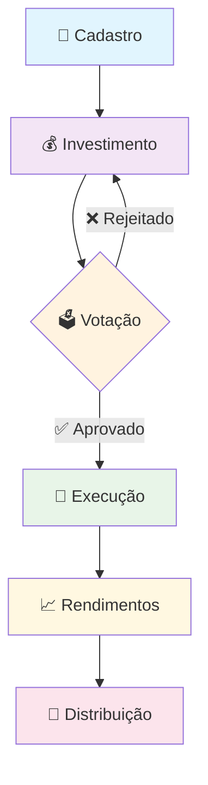
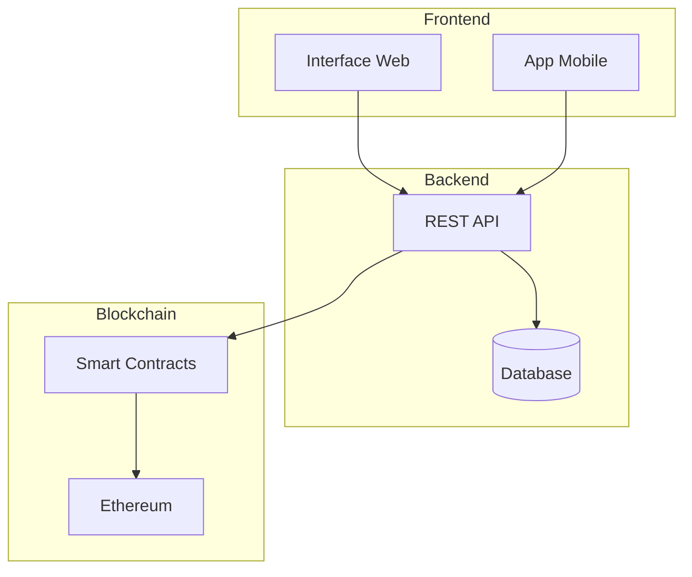
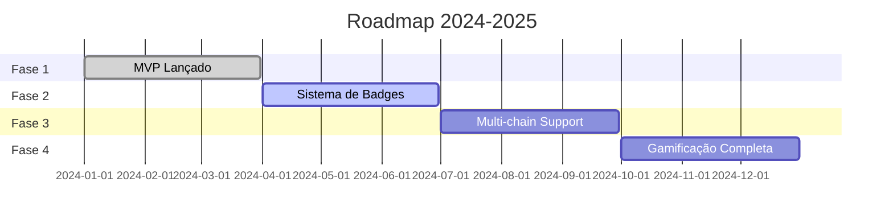

# community_liquidy_pools
Um projeto comunitário para quem quer investir em pools de liquides de forma transparente, comunitária e coordenada. 

APP: https://www.perplexity.ai/apps/334968ec-7ed5-45d7-8163-53876f5ef21b?0=c

# 🌊💧 Community Liquidity Pools

<p align="center">
  
</p>

<div align="center">

**Invista em pools de liquidez de forma transparente e colaborativa!**

*Renda passiva • Diversificação • Governança comunitária • Open Source MIT*

🇧🇷 🇺🇸 🇪🇸

[](https://discord.gg/seulink)
[](https://github.com/govinda777/community_liquidy_pools/issues)
[](LICENSE)

**APP:** [🚀 Acesse aqui](https://www.perplexity.ai/apps/334968ec-7ed5-45d7-8163-53876f5ef21b?0=c)

</div>

---

## 🎯 Por que participar?

- ✨ **Transparência Total** - Todas as operações são públicas
- 🤝 **Governança Coletiva** - Você decide junto com a comunidade
- 💰 **Renda Passiva** - Ganhe enquanto dorme
- 🛡️ **Risco Minimizado** - Estratégias inteligentes em grupo
- 🦄 **Open Source** - Código 100% auditável

---

## 📊 Como Funciona



---

## 🏗️ Arquitetura



---

## 🎮 Sistema de Conquistas

| 🏅 Badge | 🎯 Missão | 🎁 Recompensa |
|----------|-----------|---------------|
| 💧 Pool Starter | Fazer primeiro cadastro | Sticker digital |
| 🏆 Pool Guru | Participar de 5 votações | Avatar especial |
| 💬 Pool Influencer | Convidar 3 amigos | Badge animada |
| 🎯 Pool Maker | Sugerir melhoria aceita | Prêmio surpresa |

---

## 🚀 Começando

### Passo 1: Clone o repositório
```
git clone https://github.com/govinda777/community_liquidy_pools.git
cd community_liquidy_pools
```

### Passo 2: Instale dependências
```
npm install
```

### Passo 3: Execute o projeto
```
npm start
```

### Passo 4: Acesse o app
Abra [http://localhost:3000](http://localhost:3000) no seu navegador

---

## 🎥 Demo

<p align="center">
  
</p>

---

## ❓ Perguntas Frequentes

<details>
<summary>🤔 Como funciona o projeto?</summary>

Reunimos investidores em pools coordenados com decisões coletivas e transparência total para maximizar retornos e minimizar riscos.

</details>

<details>
<summary>⚠️ Quais são os riscos?</summary>

Como todo investimento DeFi, existem riscos de volatilidade e perda impermanente. Nossa abordagem comunitária ajuda a minimizar esses riscos.

</details>

<details>
<summary>📊 Como acompanho rendimentos?</summary>

Temos dashboards em tempo real onde você pode monitorar todos os pools, votações e seus rendimentos de forma transparente.

</details>

<details>
<summary>💰 Qual o valor mínimo?</summary>

Não há valor mínimo! A ideia é ser inclusivo para investidores de todos os perfis.

</details>

<details>
<summary>🤔 Como a DAO (Organização Autônoma Descentralizada) funciona?</summary>

A nossa DAO foi projetada para ser o centro da tomada de decisões da comunidade. Ela opera de forma transparente e democrática, permitindo que todos os membros com participação (tokens de governança) possam propor e votar em melhorias para a plataforma. O processo funciona da seguinte forma:
1.  **Proposta**: Qualquer membro pode criar uma proposta de melhoria, como a criação de um novo pool de liquidez, uma alteração nas taxas ou uma atualização no sistema.
2.  **Debate**: A proposta é aberta para debate na comunidade (através do nosso Discord e fórum) para que todos possam dar sua opinião.
3.  **Votação**: Após o período de debate, a proposta é colocada em votação. O poder de voto de cada membro é proporcional à sua participação na plataforma.
4.  **Execução**: Se a proposta atingir o quórum mínimo e a maioria de votos favoráveis, ela é automaticamente executada pelo smart contract.

</details>

<details>
<summary>💸 Como eu adiciono fundos na minha carteira?</summary>

Para participar dos pools, você precisa ter fundos na sua carteira de criptomoedas conectada à nossa plataforma. Siga estes passos:
1.  **Conecte sua Carteira**: Certifique-se de que sua carteira de criptomoedas (como MetaMask, Trust Wallet, etc.) está conectada à nossa plataforma.
2.  **Acesse a Seção "Carteira"**: No seu painel de usuário, vá para a seção "Carteira" ou "Fundos".
3.  **Escolha o Ativo**: Selecione a criptomoeda que você deseja depositar.
4.  **Envie os Fundos**: Você verá um endereço de depósito. Envie as criptomoedas da sua corretora (exchange) ou de outra carteira para este endereço.
5.  **Confirmação**: Aguarde a confirmação da transação na blockchain. Assim que confirmada, os fundos aparecerão no seu saldo na plataforma.

</details>

<details>
<summary>⚠️ Por que eu só posso enviar fundos de contas da minha titularidade?</summary>

Esta é uma medida de segurança e conformidade (compliance) extremamente importante. Enviar fundos de uma conta de mesma titularidade (ou seja, uma conta que também está no seu nome) garante:
-   **Segurança**: Evita que seus fundos sejam bloqueados por suspeita de fraude ou lavagem de dinheiro.
-   **Conformidade Regulatória**: Ajuda a plataforma e os usuários a estarem em conformidade com as leis e regulações locais e internacionais.
-   **Rastreabilidade**: Garante que os fundos possam ser facilmente rastreados em caso de qualquer problema.
<br>
**Atenção**: O envio de fundos de contas de terceiros pode resultar no bloqueio permanente dos fundos e/ou da sua conta na plataforma.

</details>

---

## 📈 Roadmap



---

## 🤝 Como Contribuir

1. **Fork** este repositório
2. **Clone** seu fork
3. **Crie** uma branch para sua feature
4. **Commit** suas mudanças
5. **Push** para a branch
6. Abra um **Pull Request**

---

## 📞 Comunidade

- 💬 [Discord](https://discord.gg/seulink)
- 🐦 [Twitter](https://twitter.com/seutwitter)
- 📧 [Email](mailto:contato@seudominio.com)

---

## 📄 Licença

Este projeto está sob a licença MIT. Veja o arquivo [LICENSE](LICENSE) para mais detalhes.

---

<div align="center">

**"Invista com clareza, participe com confiança e cresça com a comunidade!"** 

🌊💧🤝

Made with ❤️ by Community Liquidity Pools Team

</div>

[1](https://docs.github.com/en/repositories/creating-and-managing-repositories/repository-limits)
[2](https://stackoverflow.com/questions/58688651/is-there-line-limit-in-github-page)
[3](https://docs.github.com/en/enterprise-server@3.17/repositories/creating-and-managing-repositories/repository-limits)
[4](https://docs.github.com/github/writing-on-github/getting-started-with-writing-and-formatting-on-github/basic-writing-and-formatting-syntax)
[5](https://docs.github.com/pt/enterprise-cloud@latest/pages/getting-started-with-github-pages/github-pages-limits)
[6](https://github.com/readthedocs/readthedocs.org/issues/5830)
[7](https://dev.to/grahamthedev/take-your-github-readme-to-the-next-level-responsive-and-light-and-dark-modes--3kpc)
[8](https://stackoverflow.com/questions/44810511/how-to-add-empty-spaces-into-md-markdown-readme-on-github)
[9](https://www.markdownguide.org/hacks/)
[10](https://blog.scalar.com/p/how-we-created-an-animated-responsive)
